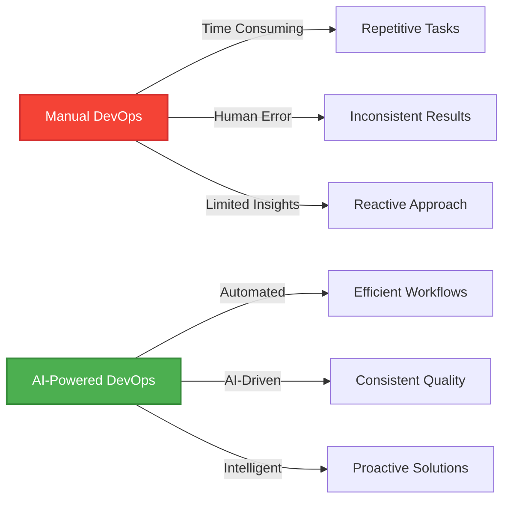
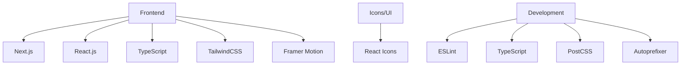
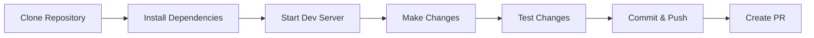
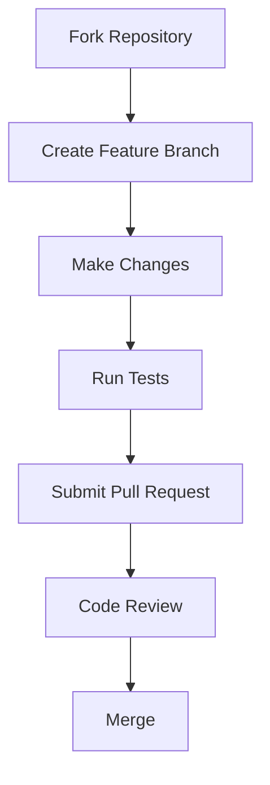

<h1 align="center">🤖 DevOps AI Agents Platform 🚀</h1>

<div align="center">
  
</div>

<div align="center">
  
  
  
  
  
  
  
  
  
  [](https://opensource.org/licenses/MIT)
  [](http://makeapullrequest.com)
  [](https://github.com/Yash-Kavaiya/Devops-AI-Agents/graphs/commit-activity)
  
</div>

<p align="center">
  <b>🌟 Transform your DevOps workflow with AI-powered automation 🌟</b>
  <br>
  <i>A comprehensive platform designed to streamline DevOps operations, automate routine tasks, and provide intelligent insights for your infrastructure and application development.</i>
</p>

<div align="center">

[](http://makeapullrequest.com)
[](LICENSE)
[](https://github.com/Yash-Kavaiya)

</div>

---

## 📋 Table of Contents

- [✨ Features](#-features)
- [🎯 Why DevOps AI Agents?](#-why-devops-ai-agents)
- [🛠️ Technology Stack](#️-technology-stack)
- [🚀 Getting Started](#-getting-started)
  - [Prerequisites](#prerequisites)
  - [Installation & Setup](#installation--setup)
  - [Build for Production](#build-for-production)
- [🏗️ Architecture](#️-architecture)
- [🧩 Components](#-components)
- [🧠 AI Integration](#-ai-integration)
- [📸 Screenshots](#-screenshots)
- [❓ FAQ](#-faq)
- [🐛 Troubleshooting](#-troubleshooting)
- [🗺️ Roadmap](#️-roadmap)
- [🤝 Contributing](#-contributing)
- [💬 Support](#-support)
- [📄 License](#-license)
- [🙏 Acknowledgments](#-acknowledgments)
- [📞 Contact](#-contact)

---

## 🎯 Quick Start

Get started with DevOps AI Agents in just 3 steps:

```bash
# 1. Clone and navigate to the project
git clone https://github.com/Yash-Kavaiya/Devops-AI-Agents.git && cd Devops-AI-Agents/devops-ai-agents

# 2. Install dependencies
npm install

# 3. Start the development server
npm run dev
```

🎉 Open [http://localhost:3000](http://localhost:3000) in your browser to see the platform in action!

---

## ✨ Features

<p align="center">
  
</p>

### Why Choose DevOps AI Agents Platform?

🤖 **AI-Powered Automation** - Leverage artificial intelligence to automate repetitive tasks and optimize workflows

⚡ **Real-Time Insights** - Get instant feedback and actionable recommendations from specialized AI agents

🔒 **Security First** - Built-in security scanning and compliance checks to protect your infrastructure

📊 **Comprehensive Monitoring** - Monitor performance, track incidents, and analyze trends in real-time

🚀 **Easy Integration** - Designed to integrate seamlessly with your existing DevOps tools and workflows

💡 **Intelligent Recommendations** - AI-driven suggestions to improve code quality, performance, and security

### Platform Modules

The platform offers a suite of AI-powered DevOps tools for modern software development and operations:

| Module | Description | Key Capabilities | Preview |
|--------|-------------|------------------|---------|
| 🔄 **CI/CD Pipeline** | Automate your continuous integration and delivery pipelines | Workflow optimization, AI-driven analysis, GitHub integration |  |
| ☁️ **Cloud Infrastructure** | Manage and optimize your cloud resources | Multi-cloud support, cost optimization, incident response |  |
| 🧪 **Code Analysis** | Analyze your code for quality and security issues | Static analysis, performance insights, code metrics |  |
| 🔒 **Security Scanning** | Identify and remediate security vulnerabilities | Vulnerability detection, compliance checks, remediation | |
| 🐳 **Container Orchestration** | Manage containerized applications and services | Deployment management, resource monitoring, scaling |  |
| 📊 **Performance Monitoring** | Monitor and optimize application performance | Real-time metrics, anomaly detection, historical trends |  |
| ⚡ **Load Testing** | Test system performance under various load conditions | Scenario templates, real-time analysis, resource utilization |  |
| 🚨 **Incident Response** | Detect and respond to system incidents automatically | Automated detection, response workflows, post-incident analysis | |

### 🌟 Key Highlights

- ✅ **AI-Powered Automation** - Intelligent agents handle repetitive DevOps tasks
- ✅ **VPS Native Support** - Optimized for high-performance VPS environments
- ✅ **Real-Time Monitoring** - Continuous monitoring with instant alerts
- ✅ **Security First** - Built-in security scanning and compliance checks
- ✅ **User-Friendly Interface** - Intuitive UI built with modern web technologies
- ✅ **Extensible Architecture** - Easy to add new agents and capabilities
- ✅ **Open Source** - MIT licensed and community-driven

---

## 🎯 Why DevOps AI Agents?

<div align="center">



</div>

### 🚀 Transform Your DevOps Workflow

| Traditional DevOps | DevOps AI Agents |
|-------------------|------------------|
| ⏰ Manual pipeline configuration | 🤖 AI-driven pipeline optimization |
| 📝 Manual code reviews | 🔍 Automated quality analysis |
| 🐛 Reactive incident response | ⚡ Proactive issue detection |
| 💰 Unpredictable cloud costs | 📊 AI-powered cost optimization |
| 🔒 Periodic security scans | 🛡️ Continuous security monitoring |
| 📈 Limited performance insights | 🧠 Deep performance analytics |

---

## 🛠️ Technology Stack

<div align="center">



</div>

### Core Technologies:

| Category | Technologies |
|----------|--------------|
| **Frontend Framework** | Next.js 14 |
| **UI Library** | React 18 |
| **Styling** | TailwindCSS with custom Microsoft-inspired theme |
| **Animations** | Framer Motion |
| **Icons** | React Icons |
| **Type Safety** | TypeScript |
| **Code Quality** | ESLint |

---

## 🚀 Getting Started

### Prerequisites

Before you begin, ensure you have the following installed:

- 📦 **Node.js** (v16.14 or later) - [Download](https://nodejs.org/)
- 📦 **npm** (v7.0 or later) or **yarn** (v1.22 or later)
- 🐍 **Python** (v3.8 or later) - For backend agents
- 🐳 **Docker** (Optional) - For containerized deployment
- 🔧 **Git** - For version control

### Installation & Setup

#### 🚀 Quick Start

```bash
# 1️⃣ Clone the repository
git clone https://github.com/Yash-Kavaiya/Devops-AI-Agents.git
cd Devops-AI-Agents/devops-ai-agents

# 2️⃣ Navigate to the frontend directory
cd devops-ai-agents

# 3️⃣ Install dependencies
npm install
# or
yarn install

# 4️⃣ Start the development server
npm run dev
# or
yarn dev

# 5️⃣ Open your browser and navigate to
# 🌐 http://localhost:3000
```

#### 🐍 Python Backend Setup (Optional)

```bash
# Navigate to the root directory
cd /workspaces/Devops-AI-Agents

# Create a virtual environment
python -m venv venv

# Activate the virtual environment
# On Linux/Mac:
source venv/bin/activate
# On Windows:
# venv\Scripts\activate

# Install Python dependencies (when available)
pip install -r requirements.txt
```

The application will be available at `http://localhost:3000`

#### Option 2: Docker Installation

<div align="center">

```bash
# Clone the repository
git clone https://github.com/Yash-Kavaiya/Devops-AI-Agents.git
cd Devops-AI-Agents

# Build and run with Docker
docker build -t devops-ai-agents .
docker run -p 3000:3000 devops-ai-agents
```

</div>

#### Environment Variables (Optional)

Create a `.env.local` file in the `devops-ai-agents` directory for custom configurations:

```env
# Application
NEXT_PUBLIC_APP_URL=http://localhost:3000

# AI Integration (Optional - for future use)
OPENAI_API_KEY=your_openai_api_key
ANTHROPIC_API_KEY=your_anthropic_api_key

# Analytics (Optional)
NEXT_PUBLIC_GA_ID=your_google_analytics_id
```

### Development Workflow

<div align="center">



</div>

### Build for Production

```bash
# Navigate to the frontend directory
cd devops-ai-agents

# Create an optimized production build
npm run build
# or
yarn build

# Start the production server
npm run start
# or
yarn start

# Production server will be available at:
# 🌐 http://localhost:3000
```

### 🔍 Verify Installation

```bash
# Check Node.js version
node --version  # Should be v16.14 or higher

# Check npm version
npm --version   # Should be v7.0 or higher

# Check Python version
python --version  # Should be v3.8 or higher

# Run linting
npm run lint
```

---

## 🏗️ Architecture

The application follows a modern frontend architecture using Next.js App Router:

<div align="center">

```
devops-ai-agents/
├── app/                  # Next.js App Router
│   ├── ci-cd/            # CI/CD Pipeline module
│   ├── cloud-infrastructure/  # Cloud Infrastructure module
│   ├── code-analysis/    # Code Analysis module
│   ├── container-orchestration/  # Container Orchestration module
│   ├── incident-response/  # Incident Response module
│   ├── load-testing/     # Load Testing module
│   ├── performance-monitoring/  # Performance Monitoring module
│   ├── security-scanning/  # Security Scanning module
│   ├── layout.tsx        # Root layout
│   ├── page.tsx          # Home page
│   └── globals.css       # Global styles
├── components/           # Reusable React components
│   ├── AgentChat.tsx     # AI assistant chat interface
│   ├── FeatureCard.tsx   # Feature card component
│   ├── PageLayout.tsx    # Common page layout
│   └── Sidebar.tsx       # Navigation sidebar
├── public/               # Static assets
└── ...                   # Configuration files
```

</div>

---

## 🧩 Components

### Core Components

<div align="center">
  
</div>

| Component | Description |
|-----------|-------------|
| **PageLayout** | Consistent layout for all feature pages |
| **Sidebar** | Navigation for all platform modules |
| **AgentChat** | Interactive AI assistant interface |
| **FeatureCard** | Interactive cards for feature navigation |

### 🎨 Component Features

- **Responsive Design** - Mobile-first approach with adaptive layouts
- **Dark Mode Support** - Elegant dark theme inspired by Microsoft design
- **Smooth Animations** - Powered by Framer Motion for fluid interactions
- **Accessibility** - WCAG 2.1 compliant components
- **Modular Structure** - Reusable and maintainable component architecture

---

## 📦 Project Structure

```
Devops-AI-Agents/
│
├── 📂 devops-ai-agents/          # Frontend Next.js application
│   ├── 📂 app/                   # Next.js App Router pages
│   │   ├── 📄 layout.tsx         # Root layout
│   │   ├── 📄 page.tsx           # Home page
│   │   ├── 📄 globals.css        # Global styles
│   │   ├── 📂 ci-cd/             # CI/CD Pipeline module
│   │   ├── 📂 cloud-infrastructure/    # Cloud Infrastructure module
│   │   ├── 📂 code-analysis/     # Code Analysis module
│   │   ├── 📂 container-orchestration/ # Container Orchestration
│   │   ├── 📂 incident-response/ # Incident Response module
│   │   ├── 📂 load-testing/      # Load Testing module
│   │   ├── 📂 performance-monitoring/  # Performance Monitoring
│   │   └── 📂 security-scanning/ # Security Scanning module
│   │
│   ├── 📂 components/            # Reusable React components
│   │   ├── 📄 AgentChat.tsx      # AI assistant interface
│   │   ├── 📄 FeatureCard.tsx    # Feature card component
│   │   ├── 📄 PageLayout.tsx     # Common page layout
│   │   └── 📄 Sidebar.tsx        # Navigation sidebar
│   │
│   ├── 📄 package.json           # Frontend dependencies
│   ├── 📄 next.config.js         # Next.js configuration
│   ├── 📄 tailwind.config.js     # TailwindCSS configuration
│   └── 📄 tsconfig.json          # TypeScript configuration
│
├── 📂 ci_cd/                     # CI/CD Agent (Python)
│   ├── 📄 __init__.py
│   └── 📄 agent.py
│
├── 📂 cloud_infra/               # Cloud Infrastructure Agent
│   ├── 📄 __init__.py
│   └── 📄 agent.py
│
├── 📂 code_anals/                # Code Analysis Agent
│   ├── 📄 __init__.py
│   └── 📄 agent.py
│
├── 📂 cona/                      # Container Orchestration Agent
│   ├── 📄 __init__.py
│   └── 📄 agent.py
│
├── 📂 iinciden/                  # Incident Response Agent
│   ├── 📄 __init__.py
│   └── 📄 agent.py
│
├── 📂 load/                      # Load Testing Agent
│   ├── 📄 __init__.py
│   └── 📄 agent.py
│
├── 📂 monier/                    # Monitoring Agent
│   ├── 📄 __init__.py
│   └── 📄 agent.py
│
├── 📂 performance/               # Performance Agent
│   ├── 📄 __init__.py
│   └── 📄 agent.py
│
├── 📂 securi/                    # Security Agent
│   ├── 📄 __init__.py
│   └── 📄 agent.py
│
├── 📂 Images/                    # Documentation images
├── 📄 Dockerfile                 # Docker configuration
├── 📄 README.md                  # This file
└── 📄 LICENSE                    # MIT License
```

---

## 🔌 API Documentation

### Agent Communication Protocol

Each AI agent exposes a consistent API for interaction:

```typescript
interface AgentRequest {
  action: string;
  parameters: Record<string, any>;
  context?: string;
}

interface AgentResponse {
  success: boolean;
  data?: any;
  message: string;
  suggestions?: string[];
}
```

### Available Actions by Agent

#### CI/CD Agent
- `analyze-pipeline` - Analyze pipeline configuration
- `optimize-workflow` - Suggest workflow improvements
- `detect-bottlenecks` - Identify pipeline bottlenecks

#### Cloud Infrastructure Agent
- `analyze-resources` - Review cloud resource utilization
- `cost-optimization` - Provide cost-saving recommendations
- `scaling-advice` - Suggest scaling strategies

#### Security Agent
- `scan-vulnerabilities` - Perform security scan
- `compliance-check` - Check compliance status
- `remediation-plan` - Generate remediation steps

---

## 🧪 Testing

### Running Tests

```bash
# Navigate to frontend directory
cd devops-ai-agents

# Run all tests
npm test

# Run tests in watch mode
npm test -- --watch

# Run tests with coverage
npm test -- --coverage

# Run linting
npm run lint

# Fix linting issues automatically
npm run lint -- --fix
```

### Test Structure

```
devops-ai-agents/
├── __tests__/
│   ├── components/
│   │   ├── AgentChat.test.tsx
│   │   ├── FeatureCard.test.tsx
│   │   └── Sidebar.test.tsx
│   └── pages/
│       └── home.test.tsx
```

---

## 🐳 Docker Support

### Using Docker

```bash
# Build the Docker image
docker build -t devops-ai-agents:latest .

# Run the container
docker run -p 3000:3000 devops-ai-agents:latest

# Using Docker Compose (when available)
docker-compose up -d

# Stop the container
docker-compose down
```

### Docker Configuration

The included `Dockerfile` provides:
- ✅ Multi-stage build for optimized image size
- ✅ Production-ready Node.js environment
- ✅ Security best practices
- ✅ Minimal attack surface

---

## 🔧 Configuration

### Environment Variables

Create a `.env.local` file in the `devops-ai-agents` directory:

```env
# Application Configuration
NEXT_PUBLIC_APP_NAME="DevOps AI Agents"
NEXT_PUBLIC_APP_VERSION="0.1.0"

# API Configuration
NEXT_PUBLIC_API_URL="http://localhost:8000"
NEXT_PUBLIC_API_TIMEOUT="30000"

# AI Agent Configuration
AI_MODEL_PROVIDER="openai"
AI_MODEL_NAME="gpt-4"
AI_API_KEY="your-api-key-here"

# Feature Flags
ENABLE_SECURITY_SCANNING="true"
ENABLE_LOAD_TESTING="true"
ENABLE_MONITORING="true"

# Analytics (Optional)
NEXT_PUBLIC_GA_ID="your-google-analytics-id"
```

### TailwindCSS Customization

Modify `tailwind.config.js` to customize the theme:

```javascript
module.exports = {
  theme: {
    extend: {
      colors: {
        primary: '#0078D4',
        secondary: '#2B88D8',
        accent: '#00BCF2',
        // Add your custom colors
      },
    },
  },
}
```

---

## 📈 Roadmap

### 🎯 Current Version (v0.1.0)

- ✅ Core platform architecture
- ✅ 8 specialized AI agents
- ✅ Modern UI with dark mode
- ✅ Basic agent interactions

### 🚀 Upcoming Features (v0.2.0)

- [ ] **Advanced AI Models** - Integration with GPT-4, Claude, and Llama
- [ ] **Real-time Collaboration** - Multi-user support with WebSocket
- [ ] **Custom Agent Builder** - Create your own AI agents
- [ ] **Integration Hub** - Connect with GitHub, GitLab, Jenkins, etc.
- [ ] **Advanced Analytics** - Detailed insights and reporting
- [ ] **Mobile App** - iOS and Android applications

### 🌟 Future Vision (v1.0.0)

- [ ] **Enterprise Features** - SSO, RBAC, audit logging
- [ ] **Multi-Cloud Orchestration** - Unified control across clouds
- [ ] **AI Model Training** - Train custom models on your data
- [ ] **Plugin System** - Extensible architecture for third-party plugins
- [ ] **Advanced Automation** - Self-healing infrastructure
- [ ] **Compliance Automation** - SOC2, HIPAA, GDPR compliance

---

## ❓ FAQ

<details>
<summary><b>Q: What cloud providers are supported?</b></summary>
<br>
Currently, the platform is optimized for VPS environments and major cloud providers.
</details>

<details>
<summary><b>Q: Do I need to configure AI models?</b></summary>
<br>
Yes, you'll need to provide API keys for AI models like OpenAI GPT. Check the configuration section for details.
</details>

<details>
<summary><b>Q: Is this suitable for production use?</b></summary>
<br>
The platform is currently in active development (v0.1.0). While functional, we recommend thorough testing before production deployment.
</details>

<details>
<summary><b>Q: How do I add a new AI agent?</b></summary>
<br>
Create a new directory for your agent, implement the agent.py file following the existing pattern, and add a corresponding frontend page in the app directory.
</details>

<details>
<summary><b>Q: What about data security and privacy?</b></summary>
<br>
All data is processed locally by default. When using external AI APIs, ensure you review their privacy policies. We recommend using self-hosted AI models for sensitive data.
</details>

<details>
<summary><b>Q: Can I customize the UI theme?</b></summary>
<br>
Yes! The UI is built with TailwindCSS, making it easy to customize colors, spacing, and more through the tailwind.config.js file.
</details>

---

## 🧠 AI Integration

<div align="center">
  
</div>

The platform integrates AI capabilities throughout:

| AI Feature | Description |
|------------|-------------|
| **Specialized Agents** | Each module has a dedicated AI agent with domain-specific knowledge |
| **Real-time Analysis** | AI models analyze your infrastructure and code to provide insights |
| **Proactive Suggestions** | Get actionable recommendations to improve your DevOps processes |
| **Conversational Interface** | Interact with AI agents through a natural chat interface |

---

## 📸 Screenshots

<div align="center">

### 🏠 Home Dashboard


### 🔄 CI/CD Pipeline Management


### ☁️ Cloud Infrastructure


### 📊 Performance Monitoring


### 🐳 Container Orchestration


### ⚡ Load Testing


</div>

---

## ❓ FAQ

<details>
<summary><b>What is DevOps AI Agents Platform?</b></summary>
<br>
DevOps AI Agents Platform is a comprehensive AI-powered solution designed to streamline and automate various DevOps workflows. It provides specialized AI agents for different aspects of DevOps, including CI/CD, cloud infrastructure management, security scanning, and more.
</details>

<details>
<summary><b>Do I need API keys for AI features?</b></summary>
<br>
Currently, the platform includes simulated AI responses for demonstration purposes. To integrate with real AI services, you would need to configure API keys for services like OpenAI, Anthropic, or other AI providers in your environment variables.
</details>

<details>
<summary><b>Can I use this in production?</b></summary>
<br>
This platform is primarily designed as a showcase and starting point for DevOps AI integrations. While the frontend is production-ready, you'll need to implement actual backend services and integrate with real DevOps tools for production use.
</details>

<details>
<summary><b>Which cloud providers are supported?</b></summary>
<br>
The platform is designed to be environment-agnostic. The UI supports managing resources across VPS and major cloud providers.
</details>

<details>
<summary><b>Is this open source?</b></summary>
<br>
Yes! This project is open source and licensed under the MIT License. Contributions are welcome!
</details>

<details>
<summary><b>How can I customize the AI agents?</b></summary>
<br>
Each module has its own dedicated page component where you can customize the AI agent's behavior, prompts, and responses. Check the `devops-ai-agents/app/` directory for module-specific implementations.
</details>

---

## 🐛 Troubleshooting

### Common Issues and Solutions

#### Port Already in Use
```bash
# If port 3000 is already in use, you can specify a different port:
PORT=3001 npm run dev
```

#### Module Not Found Errors
```bash
# Clear node_modules and reinstall dependencies:
rm -rf node_modules package-lock.json
npm install
```

#### Build Errors
```bash
# Clear Next.js cache and rebuild:
rm -rf .next
npm run build
```

#### TypeScript Errors
```bash
# Regenerate TypeScript declarations:
npm run dev
# Next.js will automatically regenerate type definitions
```

#### Styling Issues
```bash
# Ensure TailwindCSS is properly configured:
npm install -D tailwindcss postcss autoprefixer
npx tailwindcss init -p
```

### Still Having Issues?

If you're still experiencing problems:
1. Check the [Issues](https://github.com/Yash-Kavaiya/Devops-AI-Agents/issues) page for similar problems
2. Make sure you're using Node.js v16.14 or later
3. Try running with `npm run dev` instead of `yarn dev` (or vice versa)
4. Clear your browser cache and restart the development server
5. Create a new issue with detailed information about your problem

---

## 🗺️ Roadmap

### ✅ Completed Features
- [x] Modern, responsive UI with TailwindCSS
- [x] 8 specialized DevOps AI agent modules
- [x] Interactive chat interface for each module
- [x] Real-time performance monitoring visualizations
- [x] Comprehensive documentation

### 🚧 In Progress
- [ ] Backend API integration
- [ ] User authentication and authorization
- [ ] Persistent data storage
- [ ] Real AI model integration (OpenAI, Claude, etc.)

### 🔮 Future Enhancements
- [ ] Multi-user support with team collaboration
- [ ] Integration with popular DevOps tools (Jenkins, GitHub Actions, GitLab CI)
- [ ] Custom workflow builder
- [ ] Advanced analytics and reporting dashboard
- [ ] Mobile application (iOS & Android)
- [ ] Webhook support for event-driven automation
- [ ] Plugin system for extensibility
- [ ] Dark mode theme
- [ ] Export/Import configuration
- [ ] Kubernetes native deployment options
- [ ] Advanced security features (RBAC, audit logs)
- [ ] Integration with monitoring tools (Prometheus, Grafana, Datadog)
- [ ] Multi-language support (i18n)

### 💡 Proposed Features
Want to see a feature? [Open a feature request](https://github.com/Yash-Kavaiya/Devops-AI-Agents/issues/new) and let us know!

---

## 🤝 Contributing

Contributions are welcome! Please feel free to submit a Pull Request.

<div align="center">



</div>

### Contribution Steps

1. Fork the repository
2. Create your feature branch (`git checkout -b feature/amazing-feature`)
3. Commit your changes (`git commit -m 'Add some amazing feature'`)
4. Push to the branch (`git push origin feature/amazing-feature`)
5. Open a Pull Request

### 📝 Code Standards

- ✅ Follow the established coding style (ESLint + Prettier)
- ✅ Write tests for new features (Jest + React Testing Library)
- ✅ Keep documentation up-to-date
- ✅ Ensure your code passes all linting checks
- ✅ Write meaningful commit messages
- ✅ Add comments for complex logic
- ✅ Follow TypeScript best practices

### 🐛 Found a Bug?

If you find a bug, please open an issue with:
- Clear description of the problem
- Steps to reproduce
- Expected vs actual behavior
- Screenshots (if applicable)
- Environment details (OS, Node version, etc.)

### 💡 Feature Requests

We welcome feature requests! Please open an issue with:
- Clear description of the feature
- Use case and benefits
- Any implementation ideas (optional)

---

## 💬 Support

### Getting Help

- 📖 **Documentation**: Check this README and inline code comments
- 💬 **Discussions**: Join our [GitHub Discussions](https://github.com/Yash-Kavaiya/Devops-AI-Agents/discussions)
- 🐛 **Bug Reports**: [Open an issue](https://github.com/Yash-Kavaiya/Devops-AI-Agents/issues/new)
- 💡 **Feature Requests**: [Request a feature](https://github.com/Yash-Kavaiya/Devops-AI-Agents/issues/new)
- 📧 **Email**: For private inquiries, reach out to [Yash Kavaiya](https://github.com/Yash-Kavaiya)

### Connect With Us

<div align="center">

[](https://github.com/Yash-Kavaiya)
[](https://www.linkedin.com/in/yash-kavaiya/)

</div>

### Show Your Support

If you find this project helpful, please consider:
- ⭐ Starring the repository
- 🐛 Reporting bugs
- 💡 Suggesting new features
- 🤝 Contributing code
- 📢 Sharing with others

---

## 📄 License

This project is licensed under the **MIT License** - see the [LICENSE](LICENSE) file for details.

```
MIT License

Copyright (c) 2025 Yash Kavaiya

Permission is hereby granted, free of charge, to any person obtaining a copy
of this software and associated documentation files (the "Software"), to deal
in the Software without restriction, including without limitation the rights
to use, copy, modify, merge, publish, distribute, sublicense, and/or sell
copies of the Software, and to permit persons to whom the Software is
furnished to do so, subject to the following conditions:

The above copyright notice and this permission notice shall be included in all
copies or substantial portions of the Software.
```

---

## 🙏 Acknowledgments

Special thanks to:

- 🎨 **Microsoft Design System** - For UI/UX inspiration
- 🤖 **OpenAI** - For AI model capabilities
- ⚛️ **Vercel** - For Next.js framework and hosting
- 🎭 **Framer** - For animation library
- 🎨 **TailwindCSS Team** - For the amazing CSS framework
- 👥 **Open Source Community** - For continuous support and contributions

### 🌟 Built With

- [Next.js](https://nextjs.org/) - React framework for production
- [React](https://react.dev/) - UI component library
- [TypeScript](https://www.typescriptlang.org/) - Type-safe JavaScript
- [TailwindCSS](https://tailwindcss.com/) - Utility-first CSS framework
- [Framer Motion](https://www.framer.com/motion/) - Animation library
- [React Icons](https://react-icons.github.io/react-icons/) - Icon library
- [Python](https://www.python.org/) - Backend agent development

---

## 📞 Contact

<div align="center">

**Yash Kavaiya**

[](https://github.com/Yash-Kavaiya)
[](https://linkedin.com/in/yash-kavaiya)
[](https://twitter.com/yash_kavaiya)
[](mailto:yashkavaiya@gmail.com)

</div>

### 💬 Community & Support

- 💡 **Report Issues**: [GitHub Issues](https://github.com/Yash-Kavaiya/Devops-AI-Agents/issues)
- 🗨️ **Discussions**: [GitHub Discussions](https://github.com/Yash-Kavaiya/Devops-AI-Agents/discussions)
- 📖 **Documentation**: [Wiki](https://github.com/Yash-Kavaiya/Devops-AI-Agents/wiki)
- 🌐 **Website**: Coming Soon!

---

<div align="center">

### ⭐ Star History

[](https://star-history.com/#Yash-Kavaiya/Devops-AI-Agents&Date)

---

### 🎯 Quick Links

[🏠 Home](https://github.com/Yash-Kavaiya/Devops-AI-Agents) • 
[📖 Docs](https://github.com/Yash-Kavaiya/Devops-AI-Agents/wiki) • 
[🐛 Report Bug](https://github.com/Yash-Kavaiya/Devops-AI-Agents/issues) • 
[✨ Request Feature](https://github.com/Yash-Kavaiya/Devops-AI-Agents/issues)

---

<p align="center">
  
  
  
  
</p>

<h3 align="center">⭐ If you find this project useful, please consider giving it a star! ⭐</h3>

<p align="center">
  <b>Built with ❤️ by <a href="https://github.com/Yash-Kavaiya">Yash Kavaiya</a></b>
  <br>
  <i>Making DevOps smarter, one AI agent at a time</i>
</p>

<p align="center">
  <sub>© 2025 DevOps AI Agents Platform. All rights reserved.</sub>
</p>

<p>
  <sub>Made with passion for the DevOps community</sub>
</p>

</div>
