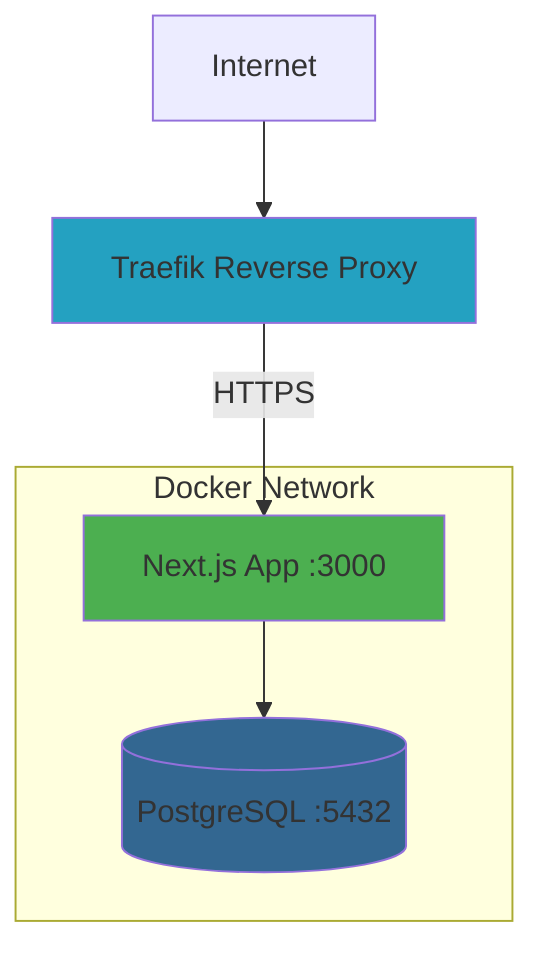

# 🚀 DevOps AI Agents - Deployment Guide

## Overview
This guide covers the complete deployment process for the DevOps AI Agents application to your VPS server at `skylabx.omniforge.com.br`.

---

## 📋 Prerequisites

### On VPS Server
- [x] Docker installed
- [x] Docker Compose installed
- [x] Traefik reverse proxy running
- [x] Domain configured: `skylabx.omniforge.com.br`
- [ ] Git repository access configured

### Required Credentials
- OpenAI API Key (for Frontend Agent)
- OpenRouter API Key (for Code Analysis & Stack Auditor)
- PostgreSQL password (secure)

---

## 🏗️ Architecture



---

## 📦 Deployment Files

### Created Files
1. **`Dockerfile`** - Multi-stage build for optimized Next.js production image
2. **`docker-compose.yml`** - Orchestrates app + PostgreSQL + Traefik integration
3. **`.dockerignore`** - Excludes unnecessary files from build
4. **`.env.example`** - Environment variables template
5. **`deploy.sh`** - Automated deployment script
6. **`prisma/migrations/`** - Database schema migrations

---

## 🔧 Initial Setup on VPS

### Step 1: Clone Repository
```bash
# SSH into your VPS
ssh root@your-vps-ip

# Navigate to projects directory
cd /root

# Clone the repository
git clone https://github.com/jessefreitas/devops-ai-agents.git
cd devops-ai-agents
```

### Step 2: Configure Environment Variables
```bash
# Create production environment file
cp .env.example .env.production

# Edit with your credentials
nano .env.production
```

**Required values in `.env.production`:**
```env
POSTGRES_PASSWORD=your_secure_postgres_password_here
OPENAI_API_KEY=sk-proj-...
OPENROUTER_API_KEY=sk-or-v1-...
```

### Step 3: Make Deploy Script Executable
```bash
chmod +x deploy.sh
```

### Step 4: Ensure Traefik Network Exists
```bash
# Check if traefik-network exists
docker network ls | grep traefik-network

# If not, create it
docker network create traefik-network
```

---

## 🚀 Deployment Process

### First-Time Deployment
```bash
# Run the deployment script
./deploy.sh
```

The script will:
1. ✅ Pull latest code from GitHub
2. ✅ Stop existing containers
3. ✅ Build Docker images
4. ✅ Start PostgreSQL database
5. ✅ Start Next.js application
6. ✅ Run database migrations
7. ✅ Generate Prisma Client
8. ✅ Show container status and logs

### Subsequent Deployments
Simply run the same command:
```bash
./deploy.sh
```

---

## 🔍 Verification & Monitoring

### Check Container Status
```bash
docker-compose ps
```

Expected output:
```
NAME                   STATUS              PORTS
devops-ai-app          Up (healthy)        3000/tcp
devops-ai-postgres     Up (healthy)        5432/tcp
```

### View Application Logs
```bash
# Follow logs in real-time
docker-compose logs -f app

# View last 50 lines
docker-compose logs --tail=50 app
```

### View Database Logs
```bash
docker-compose logs -f postgres
```

### Test Application Access
```bash
# From VPS
curl -I http://localhost:3000

# From browser
https://skylabx.omniforge.com.br
```

---

## 🗄️ Database Management

### Access PostgreSQL
```bash
docker-compose exec postgres psql -U postgres -d devops_ai
```

### Run Migrations Manually
```bash
docker-compose exec app npx prisma migrate deploy
```

### View Database Schema
```bash
docker-compose exec app npx prisma studio
# Access at http://localhost:5555
```

### Backup Database
```bash
docker-compose exec postgres pg_dump -U postgres devops_ai > backup_$(date +%Y%m%d).sql
```

### Restore Database
```bash
cat backup_20260122.sql | docker-compose exec -T postgres psql -U postgres devops_ai
```

---

## 🛠️ Troubleshooting

### Container Won't Start
```bash
# Check logs for errors
docker-compose logs app

# Rebuild without cache
docker-compose build --no-cache
docker-compose up -d
```

### Database Connection Issues
```bash
# Verify database is healthy
docker-compose exec postgres pg_isready -U postgres

# Check DATABASE_URL in container
docker-compose exec app env | grep DATABASE_URL
```

### Traefik Not Routing
```bash
# Check Traefik labels
docker inspect devops-ai-app | grep -A 10 Labels

# Verify network connection
docker network inspect traefik-network
```

### Application Errors
```bash
# Check Next.js build logs
docker-compose logs --tail=100 app

# Restart application
docker-compose restart app
```

---

## 🔄 Update Workflow

### Standard Update Process
1. Make changes locally
2. Commit and push to GitHub
3. SSH into VPS
4. Run `./deploy.sh`

### Rollback to Previous Version
```bash
# Stop containers
docker-compose down

# Checkout previous commit
git log --oneline  # Find commit hash
git checkout <commit-hash>

# Redeploy
./deploy.sh
```

---

## 📊 Performance Optimization

### View Resource Usage
```bash
docker stats devops-ai-app devops-ai-postgres
```

### Optimize Database
```bash
docker-compose exec postgres psql -U postgres -d devops_ai -c "VACUUM ANALYZE;"
```

### Clear Docker Cache
```bash
docker system prune -a --volumes
```

---

## 🔐 Security Checklist

- [x] Environment variables in `.env.production` (not committed to git)
- [x] PostgreSQL password is strong and unique
- [x] HTTPS enabled via Traefik
- [x] Database not exposed to public internet
- [ ] Regular backups configured
- [ ] Monitoring and alerts set up

---

## 📞 Support & Resources

### Useful Commands
```bash
# Stop all services
docker-compose down

# Start services
docker-compose up -d

# View all containers
docker ps -a

# Remove all stopped containers
docker container prune
```

### Access Points
- **Application**: https://skylabx.omniforge.com.br
- **Database**: Internal only (postgres:5432)
- **Logs**: `docker-compose logs -f`

---

## 🎯 Next Steps

After successful deployment:
1. ✅ Verify application is accessible
2. ✅ Test all agent features (Frontend, Stack Auditor, Code Analysis)
3. ✅ Configure monitoring/alerting
4. ✅ Set up automated backups
5. ✅ Document any custom configurations

---

**Deployment Date**: 2026-01-22  
**Version**: 0.1.0  
**Domain**: skylabx.omniforge.com.br
